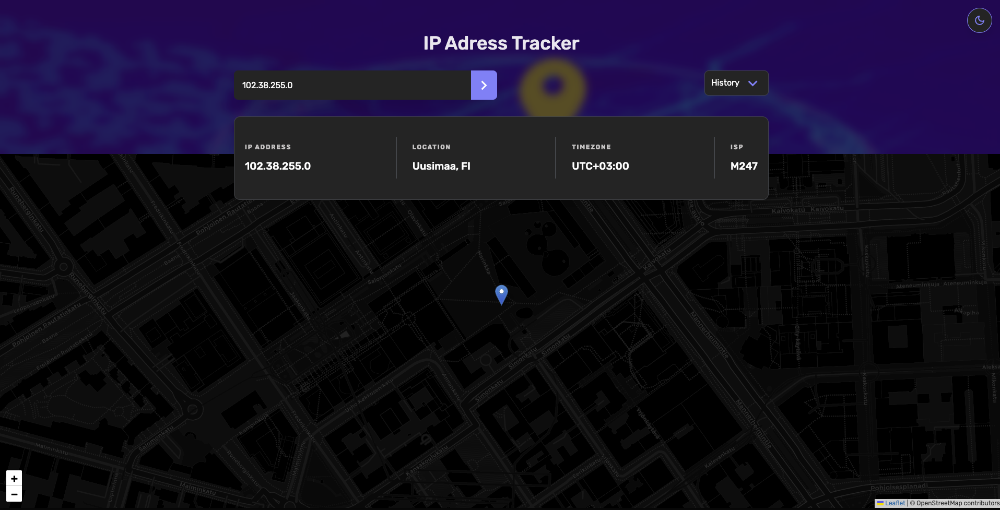

# 🌐 IP Address Tracker

Live site: [https://victorkevz.github.io/ip-address-tracker/](https://victorkevz.github.io/ip-address-tracker/)  
Repo: `git@github.com:VictorKevz/ip-address-tracker.git`  
Challenge: [Frontend Mentor – IP Address Tracker](https://www.frontendmentor.io/challenges/ip-address-tracker-I8-0yYAH0)


## 📖 About

This is a React + TypeScript application that tracks and displays IP address geolocation data on an interactive map. Built as a solution to the Frontend Mentor challenge, with enhancements and UI customizations beyond the original design.


## 🧠 Features

- Shows user's IP and location on initial load
- Search for IP addresses or domain names
- Displays IP address, location (city, region, country), timezone, and ISP
- Interactive map powered by Leaflet.js
- Responsive design for all screen sizes
- **Dark/Light theme toggle**
- **Animated transitions**
- **Search history saved in `localStorage`**
- **Toast-style alerts for success and errors**
- **Warning modal for invalid inputs**
- **Dedicated error UI**
- **Hover and focus states for all interactive elements**
- **ARIA attributes for accessibility**


## 🧪 Tech Stack

- React (Vite)
- TypeScript
- Tailwind CSS
- Leaflet.js
- IPify Geolocation API
- Framer Motion (for animations)
- `index.css` for additional custom styling (no global CSS framework)


## 📦 Installation

```bash
git clone git@github.com:VictorKevz/ip-address-tracker.git
cd ip-address-tracker
npm install

Create a .env file in the root:

VITE_API_KEY=your_ipify_api_key_here

Then run the dev server:

npm run dev

```

⸻

🗂️ File Structure (simplified)

src/
│
├── components/         # Reusable UI components
├── hooks/              # Custom React hooks
├── context/            # React Context for shared state
├── types/              # TypeScript type definitions
├── styles/             # Tailwind + index.css
├── App.tsx             # App entry
└── main.tsx            # Vite entry


⸻

## Challenge Requirements (from FEM)
	•	Show user’s IP info and location on load
	•	Allow IP address or domain search
	•	Display relevant IP/location info
	•	Show interactive map with correct location marker
	•	Ensure responsive layout
	•	Add hover/focus states to interactive elements

⸻

⚙️ Enhancements Added

## Feature	Description
Theme Toggle	Switch between light/dark mode
Animations	Smooth page transitions and UI feedback via Framer Motion
Search History	Saves previous lookups in localStorage
Alerts	Custom alert system for success/errors
Warning Modal	Modal prompt for invalid inputs
Error UI	Dedicated view for network/API errors
Accessibility	ARIA labels, keyboard navigation, and focus states


⸻

## API & Tools Used
	•	IPify Geolocation API
	•	Leaflet.js
	•	Tailwind CSS
	•	Framer Motion

⸻

## Lessons Learned
	•	Integrating third-party APIs with robust error handling
	•	Managing state with React Context + Hooks
	•	Building accessible and responsive UIs
	•	Leveraging Tailwind CSS for design consistency
	•	Animating components with Framer Motion

⸻

## Potential Improvements
	•	Add unit tests for core logic (search, API fetch, state management)
	•	Persist search history across devices via cloud storage
	•	Add rate-limit handling for API edge cases
	•	Improve map UX with zoom lock or marker clustering


